# Nova Arquitetura - Sistema de Vault DREX para Assistência Estudantil

## Prompt de Origem

Sim, eu quero muito que você planeje tudo como se fosse do zero mesmo, eu gostaria muito se cadastro de coisas externas, por exemplo informações cadastrais diversas, pudessem ser cadastradas em um servidor externo, além desse servidor, eu também quero um indexador que vai indexar as transferências dos alunos, esse contrato será somente um contrato de Vault mesmo, que vai receber dinheiro de fora e distribuir entre os endereços cadastrados como beneficiários, ou seja, ele só pode receber exatamente a quantia que equivale a soma do dinheiro que todos os alunos devem receber, o contrato terá que armazenar esse número e alterar ele no cadastro, edição ou remoção de um aluno. Você terá que armazenar o endereço do estudante e também a quantidade de dinheiro que aquele estudante tem direito a receber por mês. Eu quero que você crie essa arquitetura usando sequential thinking mcp, e crie UM arquivo .md explicando toda a solução.

**Nota sobre transferências**: eu quero que funcione da seguinte forma, o estudante vai ser autorizado a fazer todas as transferências que ele quiser com o dinheiro dele, mas em um servidor de fora, o aluno será notificado a cadastrar cpf/cnpj e nome para os endereços que ele transferiu.

Quero diagramas de classe com nomes das funções para o contrato de Vault.
Quero diagramas de classe que componham a estrutura do servidor;
Quero diagramas de classe que componham a estrutura do indexador;
Quero o diagrama de banco de dados para o banco de dados de cadastro de estudantes e "recebedores".

Quero diagramas mermaid sequenciais sobre as operações:
- Contrato de Vault recebendo o dinheiro exato do governo para distribuir entre os alunos (ou seja, o balance de cada aluno vai incrementar do valor que ele tem direito a receber);
- Cadastrando estudante no contrato(Pode ser só o address e o valor ao qual ele tem direito por mês, o balance dele inicializa como 0);
- Cadastrando tipo de despesa no servidor (Um funcionário da UFSC poderá cadastrar (usando o servidor apenas) tipo de despesa, que um aluno terá direito a gastar com isso, por exemplo, moradia, alimentação, materiais de estudo)
- Cadastrando estudante no servidor (Aqui terá que cadastrar os limites de gasto em porcentagem ou valor absoluto para cada coisa)
- Contrato de Vault manejando transferências de um aluno para qualquer endereço de carteira (mesmo um que não seja de estudante) e emitindo um evento para cada transferência.
- Indexador indexando as transferências que os estudantes fizeram para outros endereços, durante a indexação o indexador pode verificar se o endereço de destino está cadastrado no servidor e colocar uma flag na transação de "isUnknownDestiny", essa transação também deverá ser armazenada com o timestamp.
- Estudante vendo seu saldo no aplicativo (puxa balance direto do contrato)
- Estudante vendo seu histórico de transações
- Estudante pode entrar em uma transação e enviar o CNPJ/CPF do endereço de destino e o tipo de despesa daquela transação.
- Estudante usando dapp/app para transferir.
- Precisamos de um dapp/app que o estudante possa interagir.
- Servidor deverá ter pelo menos um sistema de login simples para funcionários da UFSC, então esse fluxo também terá que ser abordado.
Anote essa minha mensagem inteira na íntegra no arquivo .md como ## Prompt de Origem

---

## 🏗️ Visão Geral da Arquitetura

### Componentes Principais

1. **Smart Contract Vault** - Gerencia fundos e transferências
2. **Servidor de Cadastro** - Gerencia dados dos estudantes e estabelecimentos
3. **Indexador Blockchain** - Monitora e indexa transações
4. **Aplicativo Mobile/Web** - Interface para estudantes
5. **Painel Administrativo** - Interface para funcionários UFSC

### Fluxo de Dados

```
Governo → Vault Contract → Estudante → Qualquer Endereço
    ↓           ↓              ↓            ↓
Servidor ← Indexador ← Blockchain Events ← Transações
```

---

## 📋 Diagrama de Classes - Smart Contract Vault


---

## 🖥️ Diagrama de Classes - Servidor de Cadastro


---

## 🔍 Diagrama de Classes - Indexador


---

## 🗄️ Diagrama de Banco de Dados


---

## 🔄 Diagramas Sequenciais

### 1. Qualquer Endereço Depositando Fundos no Vault

```mermaid
sequenceDiagram
    participant Depositor as Depositante (Gov/Qualquer)
    participant Vault as StudentAssistanceVault
    participant DREX as DREX Token
    participant Admin as Administrador
    
    Depositor->>Vault: Consulta totalExpectedAmount()
    Vault-->>Depositor: Retorna valor total necessário
    
    alt Depósito via transferência direta
        Depositor->>DREX: transfer(vault, exactAmount)
        DREX->>Vault: receive() triggered
        Vault->>Vault: Valida amount == totalExpectedAmount
        Vault->>Vault: emit DrexDeposited(from, amount, timestamp)
    else Depósito via approve + depositDrex
        Depositor->>DREX: approve(vault, amount)
        DREX-->>Depositor: Aprovação confirmada
        Depositor->>Vault: depositDrex(amount)
        Vault->>DREX: transferFrom(depositor, vault, amount)
        Vault->>Vault: Valida amount == totalExpectedAmount
        Vault->>Vault: emit DrexDeposited(from, amount, timestamp)
    end
    
    Note over Vault: ⚠️ DISTRIBUIÇÃO MANUAL NECESSÁRIA
    Note over Admin: Admin deve chamar distributeMonthlyAllowances()<br/>ou distributeBatch() em lotes
    
    Admin->>Vault: distributeMonthlyAllowances()
    Vault->>Vault: Loop através de studentAddresses[]
    Vault->>Vault: Para cada estudante: balances[student] += monthlyAmount
    Vault->>Vault: emit MonthlyDistribution(totalAmount, timestamp)
    
    Note over Vault: ⚠️ ALTO CUSTO DE GAS<br/>Cresce linearmente com número de estudantes
```

### 2. Distribuição em Lotes (Solução para Alto Volume)

```mermaid
sequenceDiagram
    participant Admin as Administrador
    participant Vault as StudentAssistanceVault
    participant Monitor as Sistema Monitor
    
    Note over Admin, Monitor: Para muitos estudantes (>100), usar distribuição em lotes
    
    Admin->>Vault: getStudentCount()
    Vault-->>Admin: totalStudents (ex: 500)
    
    Note over Admin: Divide em lotes de 50 estudantes
    
    loop Para cada lote (0-49, 50-99, 100-149, etc.)
        Admin->>Vault: distributeBatch(startIndex, endIndex)
        Vault->>Vault: Loop de startIndex até endIndex
        Vault->>Vault: Para cada estudante: balances[student] += monthlyAmount
        Vault->>Vault: emit BatchDistribution(startIndex, endIndex, timestamp)
        
        Note over Monitor: Monitora gas usado por lote
        Monitor->>Monitor: Verifica se gas < limite do bloco
    end
    
    Note over Vault: ✅ DISTRIBUIÇÃO COMPLETA<br/>Gas distribuído em múltiplas transações
```

### 3. Cadastrando Estudante no Contrato

```mermaid
sequenceDiagram
    participant Admin as Admin/Staff
    participant Vault as StudentAssistanceVault
    
    Admin->>Vault: registerStudent(address, monthlyAmount)
    Vault->>Vault: Verifica ADMIN_ROLE ou STAFF_ROLE
    Vault->>Vault: Valida se estudante não existe
    Vault->>Vault: students[address] = Student(...)
    Vault->>Vault: studentAddresses.push(address)
    Vault->>Vault: totalExpectedAmount += monthlyAmount
    Vault->>Vault: balances[address] = 0
    Vault->>Vault: emit StudentRegistered(address, amount)
    
    Note over Vault: ⚠️ IMPACTO NO GAS<br/>Estudante adicionado ao array para distribuição
```

### 4. Cadastrando Tipo de Despesa no Servidor

```mermaid
sequenceDiagram
    participant Staff as Funcionário UFSC
    participant Web as Painel Web
    participant Server as Servidor
    participant DB as Banco de Dados
    
    Staff->>Web: Login com credenciais
    Web->>Server: POST /auth/login
    Server-->>Web: JWT Token
    
    Staff->>Web: Criar tipo de despesa
    Web->>Server: POST /expense-types (com JWT)
    Server->>Server: Valida token e permissões
    Server->>DB: INSERT INTO expense_types
    DB-->>Server: Tipo criado
    Server-->>Web: Resposta de sucesso
    Web-->>Staff: Confirmação
```

### 5. Cadastrando Estudante no Servidor

```mermaid
sequenceDiagram
    participant Staff as Funcionário UFSC
    participant Web as Painel Web
    participant Server as Servidor
    participant DB as Banco de Dados
    participant Vault as StudentAssistanceVault
    
    Staff->>Web: Cadastrar estudante completo
    Web->>Server: POST /students
    Server->>DB: INSERT INTO students
    Server->>DB: INSERT INTO spending_limits (para cada tipo)
    DB-->>Server: Estudante salvo
    
    Server->>Vault: Verifica se existe no contrato
    Vault-->>Server: isStudent(address)
    
    alt Estudante não existe no contrato
        Server-->>Web: Aviso: "Registrar no contrato também"
    else Estudante já existe
        Server-->>Web: "Cadastro completo sincronizado"
    end
```

### 6. Vault Processando Transferência

```mermaid
sequenceDiagram
    participant Student as Estudante
    participant App as Aplicativo
    participant Vault as StudentAssistanceVault
    participant DREX as DREX Token
    participant Recipient as Destinatário
    
    Student->>App: Solicita transferência
    App->>Vault: transfer(to, amount)
    
    Vault->>Vault: Verifica se é estudante registrado
    Vault->>Vault: Verifica saldo suficiente
    
    alt Saldo suficiente
        Vault->>Vault: balances[student] -= amount
        Vault->>DREX: transfer(to, amount)
        DREX-->>Recipient: Recebe DREX
        Vault->>Vault: emit Transfer(from, to, amount, timestamp)
        Vault-->>App: Transferência realizada
        App-->>Student: Sucesso
    else Saldo insuficiente
        Vault-->>App: Erro: saldo insuficiente
        App-->>Student: Erro exibido
    end
```

### 7. Indexador Processando Transações

```mermaid
sequenceDiagram
    participant Indexer as Indexador
    participant Blockchain as Blockchain
    participant Vault as StudentAssistanceVault
    participant Server as Servidor
    participant DB as Banco Local
    
    loop A cada novo bloco
        Indexer->>Blockchain: Busca novos blocos
        Blockchain-->>Indexer: Eventos do bloco
        
        Indexer->>Vault: Filtra eventos Transfer
        Vault-->>Indexer: Lista de transferências
        
        loop Para cada transferência
            Indexer->>Server: checkAddressExists(toAddress)
            Server-->>Indexer: AddressInfo | null
            
            alt Endereço conhecido
                Indexer->>DB: saveTransaction(isUnknownDestiny: false)
            else Endereço desconhecido
                Indexer->>DB: saveTransaction(isUnknownDestiny: true)
            end
            
            Indexer->>Server: POST /transactions (salva no servidor)
        end
        
        Indexer->>DB: updateLastProcessedBlock(blockNumber)
    end
```

### 8. Estudante Visualizando Saldo

```mermaid
sequenceDiagram
    participant Student as Estudante
    participant App as Aplicativo
    participant Vault as StudentAssistanceVault
    participant Server as Servidor
    
    Student->>App: Abre tela de saldo
    
    par Busca saldo no contrato
        App->>Vault: getStudentBalance(address)
        Vault-->>App: Saldo atual
    and Busca dados do servidor
        App->>Server: GET /students/{address}
        Server-->>App: Dados do estudante
    end
    
    App->>App: Combina dados
    App-->>Student: Exibe saldo e informações
```

### 9. Estudante Visualizando Histórico

```mermaid
sequenceDiagram
    participant Student as Estudante
    participant App as Aplicativo
    participant Server as Servidor
    participant Indexer as Indexador DB
    
    Student->>App: Solicita histórico
    App->>Server: GET /transactions/{studentAddress}
    Server->>Indexer: Query transactions table
    Indexer-->>Server: Lista de transações
    Server-->>App: Histórico formatado
    App-->>Student: Exibe lista de transações
```

### 10. Estudante Atualizando Info da Transação

```mermaid
sequenceDiagram
    participant Student as Estudante
    participant App as Aplicativo
    participant Server as Servidor
    participant DB as Banco de Dados
    
    Student->>App: Clica em transação
    App->>Server: GET /transactions/{txHash}
    Server-->>App: Detalhes da transação
    
    Student->>App: Preenche CPF/CNPJ e tipo de despesa
    App->>Server: PUT /transactions/{txHash}
    Server->>DB: UPDATE transactions SET recipient_cpf_cnpj, expense_type_id
    Server->>DB: UPDATE is_unknown_destiny = false
    DB-->>Server: Atualização confirmada
    Server-->>App: Sucesso
    App-->>Student: "Informações salvas"
```

### 11. Estudante Fazendo Transferência via App

```mermaid
sequenceDiagram
    participant Student as Estudante
    participant App as Aplicativo
    participant Wallet as Carteira
    participant Vault as StudentAssistanceVault
    
    Student->>App: Preenche dados da transferência
    App->>App: Valida endereço e valor
    App->>Wallet: Solicita assinatura da transação
    Wallet-->>Student: Confirma transação
    Student-->>Wallet: Aprova
    Wallet->>Vault: transfer(to, amount)
    Vault->>Vault: Processa transferência
    Vault-->>App: Resultado
    App-->>Student: Confirmação ou erro
```

### 12. Gerenciamento de Roles e Emergência


### 13. Login de Funcionário UFSC

```mermaid
sequenceDiagram
    participant Staff as Funcionário
    participant Web as Painel Web
    participant Server as Servidor
    participant DB as Banco de Dados
    
    Staff->>Web: Acessa painel administrativo
    Web->>Staff: Tela de login
    Staff->>Web: Insere credenciais
    Web->>Server: POST /auth/login
    Server->>DB: SELECT user WHERE username AND password
    
    alt Credenciais válidas
        DB-->>Server: Usuário encontrado
        Server->>Server: Gera JWT token
        Server-->>Web: Token + dados do usuário
        Web->>Web: Armazena token
        Web-->>Staff: Redireciona para dashboard
    else Credenciais inválidas
        DB-->>Server: Usuário não encontrado
        Server-->>Web: Erro de autenticação
        Web-->>Staff: Mensagem de erro
    end
```

---

## ⚠️ Limitações Técnicas e Considerações de Gas

### **Problema: Mappings não são iteráveis em Solidity**

O Solidity não permite iterar sobre mappings, então para distribuir fundos para todos os estudantes, precisamos manter um array adicional `address[] studentAddresses`.

### **Impacto no Gas:**

| Número de Estudantes | Gas Estimado (distribuição) | Custo Aproximado* |
|---------------------|----------------------------|------------------|
| 50 estudantes       | ~500,000 gas              | $2-5 USD         |
| 100 estudantes      | ~1,000,000 gas            | $4-10 USD        |
| 500 estudantes      | ~5,000,000 gas            | $20-50 USD       |
| 1000 estudantes     | ~10,000,000 gas           | $40-100 USD      |

*Baseado em gas price de 20-50 gwei e ETH a $2000

### **Soluções Implementadas:**

1. **Distribuição em Lotes (`distributeBatch`)**:
   - Divide estudantes em grupos menores (ex: 50 por lote)
   - Múltiplas transações menores vs uma transação gigante
   - Evita limite de gas por bloco

2. **Limite Máximo (`MAX_STUDENTS`)**:
   - Constante que limita número total de estudantes
   - Previne crescimento descontrolado do gas
   - Sugestão: 1000-2000 estudantes máximo

3. **Monitoramento de Gas**:
   - Sistema deve monitorar custo de cada distribuição
   - Alertas quando custo exceder limites
   - Possibilidade de pausar registros se necessário

### **Alternativas Consideradas:**

1. **Pull Pattern**: Estudantes chamam função para "sacar" seu auxílio
   - ❌ Complexidade para usuários
   - ❌ Estudantes podem esquecer de sacar
   - ✅ Gas distribuído entre usuários

2. **Merkle Tree**: Provas criptográficas para distribuição
   - ✅ Gas constante independente do número de estudantes
   - ❌ Complexidade técnica muito alta
   - ❌ Fora do escopo do TCC

3. **Layer 2**: Usar sidechain ou rollup
   - ✅ Gas muito mais barato
   - ❌ Complexidade de infraestrutura
   - ❌ DREX pode não estar disponível em L2

### **Recomendação Final:**

Para o TCC, usar **distribuição em lotes** com limite de **500-1000 estudantes** é a solução mais prática, mantendo custos controláveis e implementação simples.

---

## 🛠️ Especificações Técnicas

### Smart Contract (Solidity)
- **Nome**: StudentAssistanceVault
- **Rede**: Hyperledger Besu (DREX)
- **Token**: ERC-20 (DREX)
- **Padrão**: Vault/Custódia com Role-Based Access Control
- **Roles**: ADMIN_ROLE (withdraw + gerenciar staff), STAFF_ROLE (gerenciar estudantes)
- **Segurança**: OpenZeppelin AccessControl, ReentrancyGuard
- **Depósitos**: Aceita de qualquer endereço (valor exato)

### Servidor Backend (Java Spring Boot)
- **Framework**: Spring Boot 3.x
- **Banco**: PostgreSQL
- **Autenticação**: JWT
- **API**: REST
- **Documentação**: OpenAPI/Swagger

### Indexador (Node.js)
- **Runtime**: Node.js 18+
- **Blockchain**: Web3.js/Ethers.js
- **Banco**: PostgreSQL
- **Queue**: Redis (opcional)

### Frontend
- **Mobile**: React Native + Expo
- **Web Admin**: React + TypeScript
- **Wallet**: MetaMask/WalletConnect

---

## 📁 Estrutura de Arquivos Proposta

```
tcc-monorepo/
├── packages/
│   ├── student-assistance-vault/    # Smart Contract StudentAssistanceVault
│   ├── server-backend/              # Servidor Java Spring Boot
│   ├── blockchain-indexer/          # Indexador Node.js
│   ├── student-mobile-app/          # App React Native
│   └── admin-web-panel/             # Painel Web React
├── shared/
│   ├── types/                       # Tipos TypeScript compartilhados
│   ├── constants/                   # Constantes compartilhadas
│   └── contracts/                   # ABIs e endereços dos contratos
└── docs/
    ├── api/                         # Documentação da API
    ├── deployment/                  # Guias de deploy
    └── NOVA-ARQUITETURA-VAULT.md    # Este documento
```

---

## 🚀 Próximos Passos

1. **Implementar Smart Contract Vault**
2. **Criar estrutura do servidor backend**
3. **Desenvolver indexador blockchain**
4. **Construir aplicativo mobile**
5. **Criar painel administrativo web**
6. **Integrar todos os componentes**
7. **Testes e deployment**

Esta arquitetura garante:
- ✅ **Controle total** sobre os fundos via vault
- ✅ **Flexibilidade** para transferências
- ✅ **Rastreabilidade** completa via indexador
- ✅ **Usabilidade** via aplicativos
- ✅ **Administração** via painel web
- ✅ **Segurança** via contratos auditáveis 