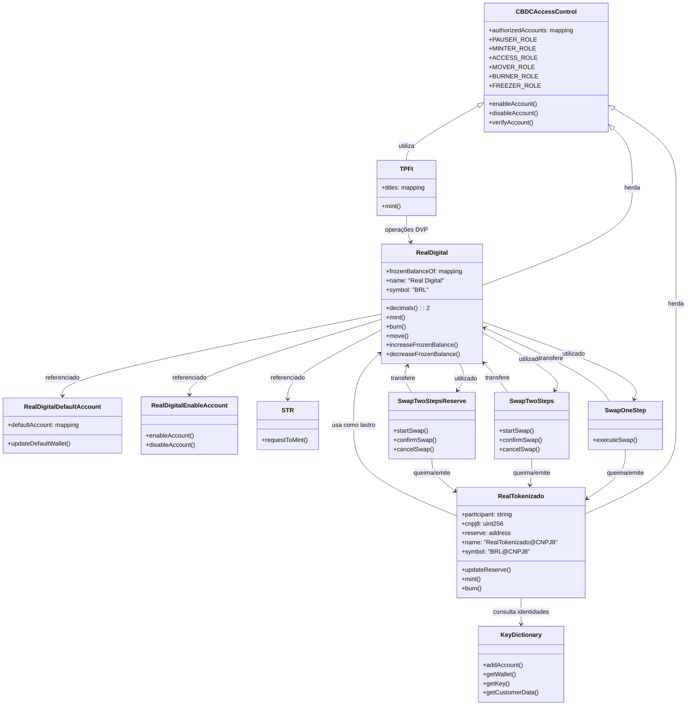

# Diagrama de Contratos do DREX

O diagrama abaixo representa as relações entre os principais contratos do DREX conforme a documentação oficial no repositório `pilotord-kit-onboarding`.

## Descrição do Diagrama

O diagrama acima mostra as relações entre os principais contratos do DREX:

1. **CBDCAccessControl** é a base para controle de acesso, implementado pelos contratos principais.

2. **RealDigital** é o token base emitido pelo Banco Central, que implementa controle de acesso.

3. **RealTokenizado** representa os tokens emitidos pelos bancos participantes (DVt e MEt), lastreados em RealDigital.

4. **STR** é o contrato que simula o Sistema de Transferência de Reservas, permitindo a emissão de RealDigital.

5. **KeyDictionary** mantém o registro de clientes, similar ao DICT (Diretório de Identificadores de Contas Transacionais).

6. Os contratos de **Swap** (**SwapOneStep**, **SwapTwoSteps**, **SwapTwoStepsReserve**) implementam diferentes modelos de transferência entre tokens.

7. **TPFt** implementa os Títulos Públicos Federais tokenizados, com suas operações específicas.

Este diagrama representa as relações documentadas oficialmente no repositório `pilotord-kit-onboarding`. 